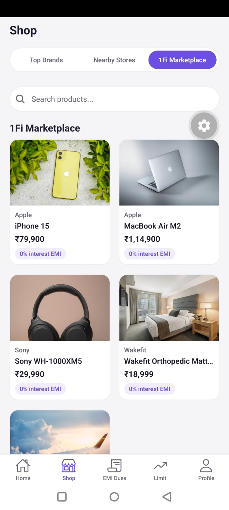
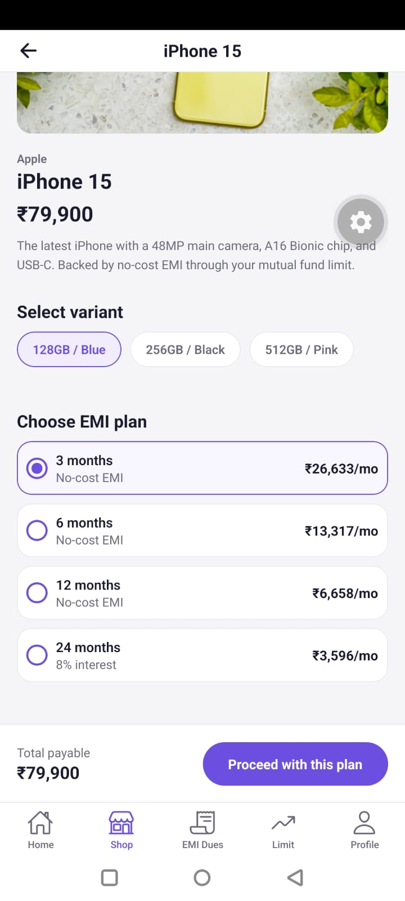
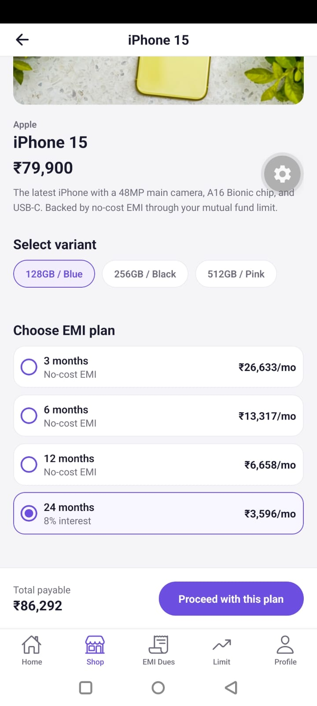

# 1Fi Marketplace — SDE Intern Assignment

A React Native (Expo) implementation of the "1Fi Marketplace" section inside the Shop
page, built per the assignment brief.

## Run it

```bash
npm install
npx expo start
```

Scan the QR code with the **Expo Go** app (Android/iOS) to run it on your phone,
or press `w` in the terminal to preview in a browser.

## What's implemented

- **Shop page** with the 3 required tabs: Top Brands (blank), Nearby Stores (blank),
  1Fi Marketplace (fully built).
- **Marketplace listing**: searchable product grid, pulled from a mock API layer
  (`src/data/api.js`) instead of hardcoded UI data — with loading and error states.
- **Product detail screen**: variant selection, EMI plan selection with live monthly
  payment calculation, and a CTA to proceed with the chosen plan.
- **Bottom tab bar** (Home / Shop / EMI Dues / Limit / Profile) matching the real
  1Fi app's navigation shell, so Marketplace sits inside the same structure it
  would in production.

## Project structure

```
src/
  components/    reusable UI pieces (ProductCard, EmiPlanSelector, Loading/ErrorState)
  data/          mock product data + a fetch-style API layer (api.js)
  navigation/    bottom tabs + shop stack navigator
  screens/       Shop, Marketplace list, Product detail, Home, Placeholder
  theme/         shared design tokens (colors, spacing, typography)
```

## Swapping in a real backend

Only `src/data/api.js` needs to change — `fetchProducts()` and `fetchProductById()`
are the only places screens touch data, so replacing the mock `delay()`/array lookup
with real `fetch()` calls to a backend requires no changes to any screen.

## Screenshots

| Marketplace List | Product Detail | EMI Plan Selected |
|---|---|---|
|  |  |  |